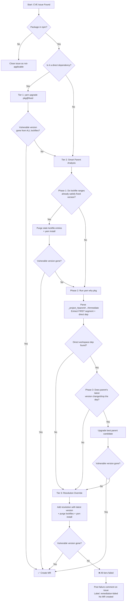

# CVE Auto-Remediation Pipeline

Automatically detects and fixes vulnerable npm packages in the LZA monorepo by creating merge requests with the minimal change needed to eliminate each CVE.

## How It Works (High Level)

The script runs in GitLab CI on a schedule. It:

1. **Fetches** all open GitLab issues labeled `CVE` + `automated`
2. **Analyzes** each issue to extract the vulnerable package name and fix version
3. **Groups** duplicate issues (multiple CVEs for the same package)
4. **Plans** a fix strategy based on where the package lives in the dependency tree
5. **Executes** fixes in dependency order (fixing parents first may resolve children)
6. **Verifies** that the vulnerable version is completely gone from ALL lockfiles
7. **Creates** one merge request per unique package fix

If a fix cannot be verified, **no MR is created** — instead, a comment is posted on the issue explaining what was tried and what's blocking the fix.

## Architecture: Two-Pass Design

```
┌─────────────────────────────────────────────────────────────┐
│                        PASS 1: ANALYSIS                      │
├─────────────────────────────────────────────────────────────┤
│  1. Fetch open CVE issues from GitLab API                    │
│  2. Parse package name + fixed version from issue title/body │
│  3. Deduplicate (group issues by package)                    │
│  4. Check npm registry for latest version                    │
│  5. Determine if package is a direct or transitive dep       │
│  6. Resolve parent relationships (yarn why)                  │
│  7. Assign fix strategy (Tier 1, 2, or 3)                   │
│  8. Build execution order (parents before children)          │
└─────────────────────────────────────────────────────────────┘
                              │
                              ▼
┌─────────────────────────────────────────────────────────────┐
│                       PASS 2: EXECUTION                      │
├─────────────────────────────────────────────────────────────┤
│  For each package (in dependency order):                     │
│    1. Check if already resolved by a prior fix               │
│    2. Create a fix branch from target                        │
│    3. Attempt Tier 1 → Tier 2 → Tier 3 (escalating)        │
│    4. Verify ALL yarn.lock files are clean                   │
│    5. Commit, push, create MR (or post failure comment)      │
│    6. Check if this fix also resolved other pending packages │
└─────────────────────────────────────────────────────────────┘
```

## The Three Fix Tiers

Each tier is progressively more invasive. The script always tries the least invasive option first and only escalates if verification fails.

### Tier 1: Direct Upgrade (Highest Confidence)

**When:** The vulnerable package is listed in a workspace `package.json` under `dependencies` or `devDependencies`.

**What it does:** `yarn upgrade <package>@<fixed_version>` (or `@<latest_version>` if the fix version is already installed — see No-Op Detection below).

**Why it's safest:** You're upgrading something you explicitly depend on. The change is intentional and visible in `package.json`.

**Example:** If `axios` is in your `devDependencies` and has a CVE fixed in `1.15.2`:
```bash
yarn upgrade axios@1.15.2
```

### Tier 2: Smart Parent Analysis — 3 Phases (Medium Confidence)

**When:** The vulnerable package is a *transitive* dependency (pulled in by something else, not listed directly in your `package.json`).

**Phase 1 — Lockfile Range Check:**
- Reads `yarn.lock` to find what semver ranges resolve to the vulnerable version
- Uses `node -e "require('semver').satisfies(...)"` to check if those ranges *already allow* the fixed version
- If yes → purge the stale lockfile entries and run `yarn install` (the fixed version resolves naturally). Also regenerates any nested lockfiles (e.g., `@aws-lza/yarn.lock`) that were affected.
- This is the fastest path — no package upgrades needed, just a lockfile refresh

**Phase 2 — Filter to Direct Workspace Deps:**
- If Phase 1 didn't work, find which *direct* workspace dependencies are ancestors of the vulnerable package
- Parent relationships are pre-computed in Pass 1 using `yarn why <pkg>`. The output format is:
  ```
  info "_project_#lerna#nx" depends on it
  ```
  This means: `project → lerna → nx → <vulnerable pkg>`. The `#`-separated path shows the chain from the workspace root down to the immediate parent.
- The parser extracts the **first** segment after `_project_#` (i.e., `lerna`) — this is the direct workspace dependency that can be upgraded. Intermediate packages (like `nx`) are not directly upgradeable.
- Only consider parents that are actually in a workspace `package.json` (not deeply nested transitive deps)

**Phase 3 — Registry Pre-Check + Targeted Upgrade:**
- For each candidate parent, query npm to see if its latest version changes/drops the dependency on the vulnerable package
- Pick the best candidate (prefers "dropped" over "changed")
- Upgrade that parent and verify the vulnerable version is gone

**Example (Phase 1 success):** `fast-uri` is vulnerable, pulled in by `ajv`. The lockfile range `^3.0.0` already allows the fix version `3.0.6`. Phase 1 just purges the stale lockfile entry and re-resolves.

**Example (Tier 2 failure → Tier 3):** `axios` is vulnerable (need `>=1.15.2`). `yarn why axios` outputs `"_project_#lerna#nx"` — the chain is `project → lerna → nx → axios`. The parser extracts `lerna` as the direct dep. Upgrading `lerna` pulls a newer `nx`, but `nx@22.7.1` still pins `axios` to exactly `"1.15.0"`. Tier 2 fails, falls through to Tier 3 (resolution override).

### Tier 3: Resolution Override (Lowest Confidence)

**When:** Tiers 1 and 2 both failed — the vulnerable version is pinned by an upstream package that hasn't released a fix yet.

**What it does:** Adds a `"resolutions"` entry to the root `package.json`, using the **latest available version** from the registry (not just the minimum fix version). This allows yarn to re-resolve the dependency tree with the newest compatible release:
```json
{
  "resolutions": {
    "vulnerable-package": "2.0.5"
  }
}
```
If the latest version is unavailable or older than the fix version, it falls back to the fix version.

**Why it's last resort:** Resolutions force a version globally, which can break packages that genuinely need the older version. They also require cleanup once upstream catches up.

**Example:** `brace-expansion@2.0.1` has a CVE fixed in `2.0.2`, but `minimatch` pins `^2.0.1` and hasn't released a version using `^2.0.2` yet. The latest available is `2.0.5`, so the resolution forces `2.0.5` everywhere — giving yarn the best chance to re-resolve cleanly.

## Decision Tree



## Key Safety Mechanisms

### Strict Lockfile Verification

After every tier attempt, the script scans **all** `yarn.lock` files in the repo (including nested ones like `@aws-lza/yarn.lock`) for any remaining vulnerable versions **in the same major version**. If even one copy remains, the fix is rejected.

```bash
# Pseudocode for verification
find source/ -name "yarn.lock" | for each lockfile:
    extract all resolved versions of the package
    for each version in the same major as fixed_version:
        if version < fixed_version:
            FAIL → escalate to next tier
```

### No-Op Detection

If the "fixed version" from the issue is already installed (the issue has stale data), the script automatically escalates to the *latest* available version from npm instead of doing nothing.

### Selective Lockfile Purge

When removing lockfile entries, the script only removes entries in the **same major version** as the fix. This prevents accidentally breaking unrelated major version streams (e.g., removing `axios@1.x` entries won't touch `axios@0.x` if both exist).

### Dependency-Ordered Execution

Packages are fixed in dependency order. If package A depends on package B, and both are vulnerable, B is fixed first. This way, fixing B might transitively resolve A without any additional changes.

### Transitive Resolution Detection

After each fix, the script checks whether other pending vulnerable packages were *also* resolved as a side effect. These are marked as "resolved transitively" and skip their own fix attempt.

## GitLab Issue Lifecycle

| State | Label | Meaning |
|-------|-------|---------|
| Open | `CVE`, `automated` | Eligible for remediation |
| Open | `remediation-started` | MR created, awaiting merge |
| Open | `remediation-failed` | All tiers failed, needs manual intervention |
| Closed | `not-applicable` | Not an npm package (pip, system, etc.) |

## Environment Variables

| Variable | Required | Description |
|----------|----------|-------------|
| `CI_API_V4_URL` | Yes | GitLab API base URL (set by CI) |
| `CI_PROJECT_ID` | Yes | GitLab project ID (set by CI) |
| `VULN_SCAN_TOKEN` | Yes | GitLab API token with issue/MR permissions |
| `VULN_ASSIGNEE` | Yes* | Username to assign MRs to (*not needed in dry-run) |
| `CVE_TARGET_BRANCH` | No | Target branch for MRs (default: `integ`) |
| `MAX_TIER2_DEPTH` | No | Max parent traversal depth (default: `5`) |
| `DRY_RUN` | No | Set to `true` to simulate without creating MRs |

## Running Locally (Dry Run)

```bash
export CI_API_V4_URL="$CI_API_V4_URL"  # Set to your GitLab instance API URL
export CI_PROJECT_ID="$CI_PROJECT_ID"  # Set to your GitLab project ID
export VULN_SCAN_TOKEN="glpat-xxxxx"
export DRY_RUN="true"

cd /path/to/lza-repo
bash .gitlab/scripts/cve-remediate.sh
```

## Common Scenarios

### "Why did Tier 2 Phase 1 work without upgrading anything?"

The lockfile (`yarn.lock`) pins exact resolved versions. Even if the semver range in a parent (like `^3.0.0`) allows the fixed version (`3.0.6`), yarn won't update it until the lockfile entry is refreshed. Phase 1 detects this situation, deletes the stale entry, and lets `yarn install` re-resolve to the latest allowed version.

### "Why was a resolution added instead of upgrading a parent?"

This happens when:
- No parent of the vulnerable package is a direct workspace dependency (can't be upgraded via `yarn upgrade`)
- The parent package's latest version still depends on the vulnerable range
- No parent has released a version that pulls in the fix

Resolutions are a temporary workaround. They should be removed once upstream packages release fixes.

### "Why did the script post a failure comment instead of creating an MR?"

The script refuses to create an MR if the vulnerable version is still present in any lockfile after all three tiers. This prevents false-confidence MRs that appear to fix the CVE but don't actually eliminate it. The failure comment explains exactly which upstream packages are blocking the fix.
