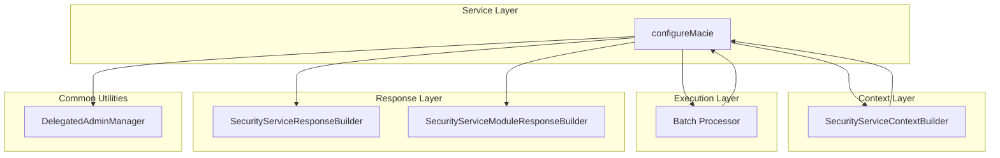
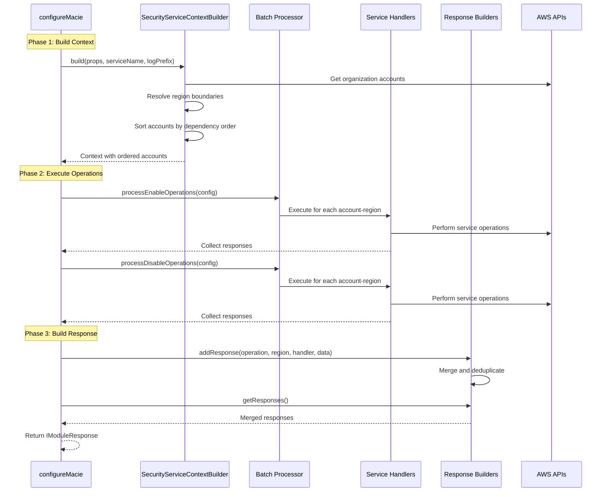
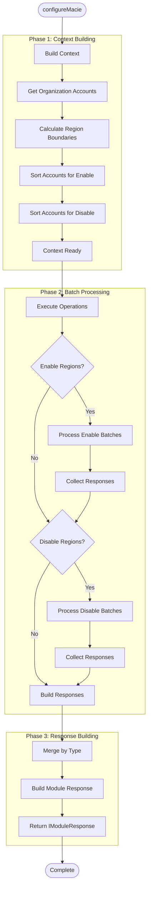
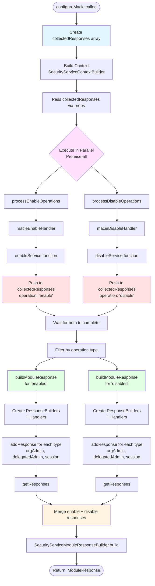
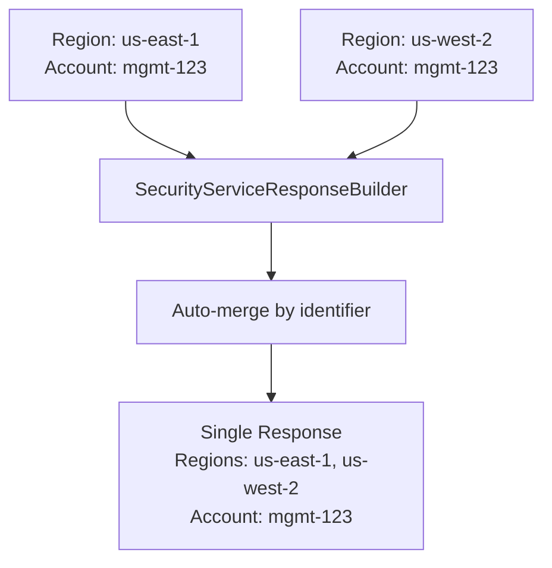
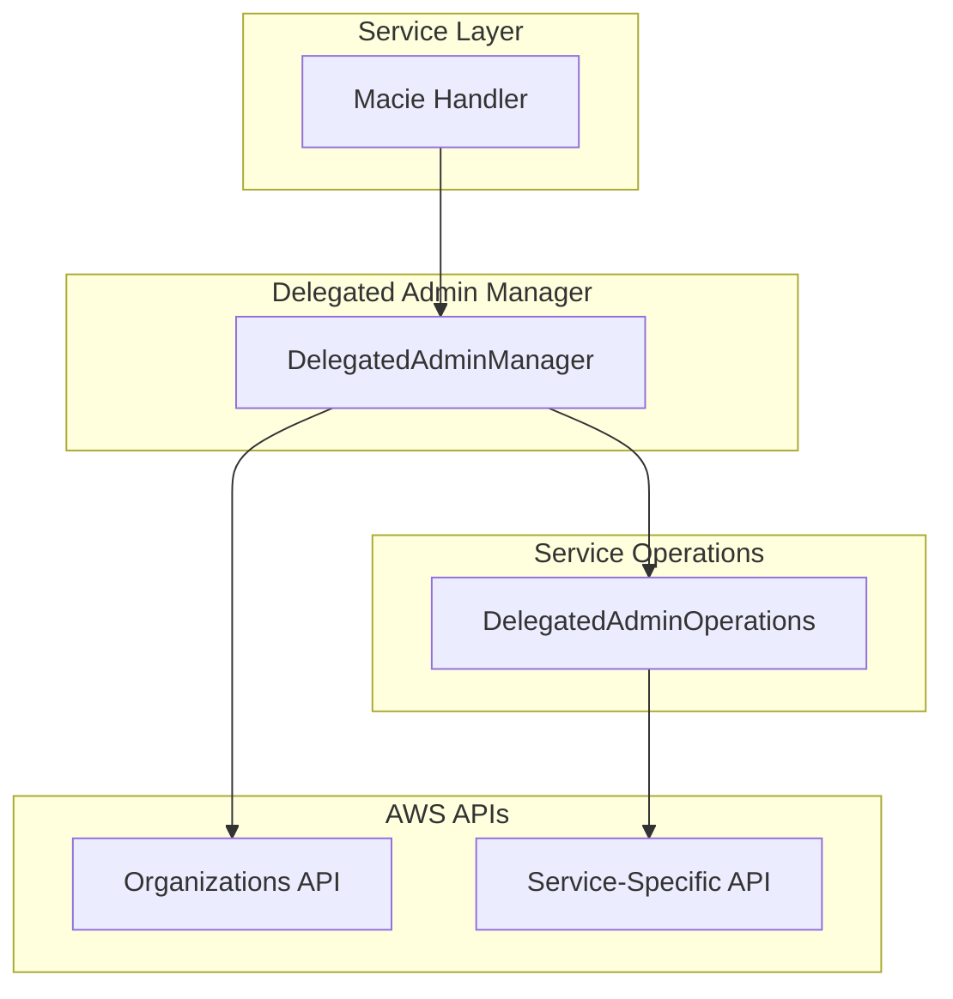

# Security Service Orchestration Architecture

## Overview

The Security Service Orchestration provides a standardized framework for integrating AWS security services (Macie, GuardDuty, Security Hub, Detective) into the AWS Landing Zone Accelerator. The architecture uses composition-based utilities for context building, batch processing, and response management.

## Architecture Design

### High-Level Architecture



### Core Components

| Component | Location | Purpose |
|-----------|----------|---------|
| **Security Components** (`lib/common/security/`) |||
| `SecurityServiceContextBuilder` | `lib/common/security/` | Builds operation context with region boundaries and account ordering |
| `SecurityServiceResponseBuilder` | `lib/common/security/` | Merges responses across regions with automatic deduplication |
| `SecurityServiceModuleResponseBuilder` | `lib/common/security/` | Builds final module response with error handling |
| `DelegatedAdminManager` | `lib/common/security/` | Manages delegated administrator setup and cleanup |
| **Common Components** (`lib/common/`) |||
| `Batch Processor` | `lib/common/` | Executes operations across accounts and regions with concurrency control |

**Note**: Service-specific response handlers (e.g., `MacieSessionResponseHandler`) are implemented in each service's directory (e.g., `lib/amazon-macie/response-factories.ts`) for service-unique response types.

## Key Principles

1. **Composition over Inheritance** - Utility classes instead of abstract base classes
2. **Explicit Data Flow** - Context built upfront and passed through
3. **Simple Pattern** - Context → Execute → Collect → Build Response
4. **Type Safety** - Full TypeScript generics for compile-time safety
5. **Reusability** - Common utilities work across all security services

## Orchestration Flow

### Three-Phase Workflow



### Execution Flow




## Implementation Pattern

### Implementation Flow

The following diagram shows how all components work together in the implementation:



**Key Points:**
- **Parallel Execution**: Enable and disable operations run in parallel using `Promise.all()` since they target different environments
- **Response Collection**: Both handlers push responses to the shared `collectedResponses` array concurrently
- **Operation Separation**: After both complete, responses are filtered by operation type ('enable' vs 'disable')
- **Parallel Building**: Enable and disable responses are built separately with their own operation types
- **Final Merge**: Both response sets are merged into the final module response

### Service-Specific Interfaces

```typescript
// Service configuration
export interface IMacieConfiguration extends ISecurityBaseConfig {
  readonly policyFindingsPublishingFrequency: FindingPublishingFrequency;
  readonly publishSensitiveDataFindings: boolean;
  readonly s3Destination: IMacieS3Destination;
}

// Module request
export interface IMacieModuleRequest extends IModuleRequest {
  readonly configuration: IMacieConfiguration;
}

// Module response
export interface IMacieModuleResponse {
  organizationAdminConfig: IOrganizationAdminResponse[];
  delegatedAdminAccountConfig: IDelegatedAccountResponse[];
  sessionConfig: IMacieSessionResponse[];  // Service-specific
}

// Internal data (what handlers return)
interface IMacieSessionData extends Record<string, unknown> {
  accountIds: string[];
  publishSensitiveDataFindings?: boolean;
  s3Destination?: IMacieS3Destination;
}
```

### Response Handler

Service-specific response handlers are created for each security service to handle unique response types that cannot be shared across services. Each service implements its own handler for service-specific configuration responses (e.g., Macie session config, GuardDuty detector config).

**Common handlers** (`OrganizationAdminResponseHandler`, `DelegatedAccountResponseHandler`) are reused across all services.

**Service-specific handlers** (like `MacieSessionResponseHandler`) are unique to each service and handle service-specific response types.

```typescript
export class MacieSessionResponseHandler {
  create(operation: SecurityModuleOperationType, region: string, data: Record<string, unknown>): IMacieSessionResponse {
    return {
      operation,
      regions: [region],
      accountIds: (data['accountIds'] as string[]) || [],
      publishSensitiveDataFindings: data['publishSensitiveDataFindings'] as boolean | undefined,
      findingPublishingFrequency: data['findingPublishingFrequency'] as string | undefined,
      s3Destination: data['s3Destination'] as IMacieS3Destination | undefined,
    };
  }

  getIdentifier(response: IMacieSessionResponse): string {
    return `${response.operation}-session`;
  }

  canMerge(existing: IMacieSessionResponse, newResponse: IMacieSessionResponse): boolean {
    return existing.operation === newResponse.operation;
  }

  merge(existing: IMacieSessionResponse, newResponse: IMacieSessionResponse): IMacieSessionResponse {
    return {
      ...existing,
      regions: [...new Set([...existing.regions, ...newResponse.regions])],
      accountIds: [...new Set([...existing.accountIds, ...newResponse.accountIds])],
      publishSensitiveDataFindings: existing.publishSensitiveDataFindings ?? newResponse.publishSensitiveDataFindings,
      findingPublishingFrequency: existing.findingPublishingFrequency ?? newResponse.findingPublishingFrequency,
      s3Destination: existing.s3Destination ?? newResponse.s3Destination,
    };
  }
}
```

### Main Service Function

```typescript
export async function configureMacie(props: IMacieModuleRequest): Promise<IModuleResponse<IMacieModuleResponse>> {
  const logPrefix = `${props.invokingAccountId}:${props.region}`;
  const collectedResponses: CollectedMacieResponse[] = [];

  try {
    // Phase 1: Build context
    const contextBuilder = new SecurityServiceContextBuilder(logger);
    const context = await contextBuilder.build(props, 'macie.amazonaws.com', logPrefix);

    // Phase 2: Execute operations
    // Pass response collection array through props
    const propsWithResponses = { ...props, collectedResponses };

    // Update context with props that include collectedResponses
    const contextWithResponses = { ...context, props: propsWithResponses };

    // Execute enable and disable operations in parallel (they target different environments)
    const [enableResults, disableResults] = await Promise.all([
      processEnableOperations({
        service: context.moduleName,
        managementAccountId: context.managementAccountId,
        orderedTargetAccounts: context.enableOrderedAccounts,
        targetRegions: context.enabledRegions,
        props: contextWithResponses.props,
        dryRun: props.dryRun ?? false,
        serviceHandler: macieEnableHandler,
        concurrency: context.concurrency,
        accountSetupHandler: macieAccountSetup,
        organizationAccounts: context.organizationAccounts,
      }),
      processDisableOperations({
        service: context.moduleName,
        managementAccountId: context.managementAccountId,
        orderedTargetAccounts: context.disableOrderedAccounts,
        targetRegions: context.disabledRegions,
        props: contextWithResponses.props,
        dryRun: props.dryRun ?? false,
        serviceHandler: macieDisableHandler,
        concurrency: context.concurrency,
        accountSetupHandler: macieAccountSetup,
        organizationAccounts: context.organizationAccounts,
      }),
    ]);

    // Phase 3: Build response
    // Separate responses by operation type
    const enableResponses = collectedResponses.filter(r => r.operation === 'enable');
    const disableResponses = collectedResponses.filter(r => r.operation === 'disable');

    // Build responses for each operation type
    const enableModuleResponse = enableResponses.length > 0
      ? buildModuleResponse('enabled', enableResponses, logPrefix)
      : { organizationAdminConfig: [], delegatedAdminAccountConfig: [], sessionConfig: [] };

    const disableModuleResponse = disableResponses.length > 0
      ? buildModuleResponse('disabled', disableResponses, logPrefix)
      : { organizationAdminConfig: [], delegatedAdminAccountConfig: [], sessionConfig: [] };

    // Merge both responses
    const macieResponse: IMacieModuleResponse = {
      organizationAdminConfig: [
        ...enableModuleResponse.organizationAdminConfig,
        ...disableModuleResponse.organizationAdminConfig,
      ],
      delegatedAdminAccountConfig: [
        ...enableModuleResponse.delegatedAdminAccountConfig,
        ...disableModuleResponse.delegatedAdminAccountConfig,
      ],
      sessionConfig: [...enableModuleResponse.sessionConfig, ...disableModuleResponse.sessionConfig],
    };

    const responseBuilder = new SecurityServiceModuleResponseBuilder(logger);
    return responseBuilder.build(
      'macie',
      props.operation,
      macieResponse,
      [...enableResults, ...disableResults],
      [],
      props.dryRun ?? false,
    );
  } catch (error) {
    const responseBuilder = new SecurityServiceModuleResponseBuilder(logger);
    const emptyResponse: IMacieModuleResponse = {
      organizationAdminConfig: [],
      delegatedAdminAccountConfig: [],
      sessionConfig: [],
    };
    return responseBuilder.buildErrorResponse(error, 'macie', props.operation, props.dryRun ?? false, emptyResponse);
  }
}
```

### Service Handlers

```typescript
// Enable handler
export const macieEnableHandler: ServiceOperationHandler<IMacieModuleRequest, void> = async (
  managementAccountId: string,
  targetAccount: Account,
  targetRegion: string,
  dryRun: boolean,
  logPrefix: string,
  props: IMacieModuleRequest,
  organizationAccounts?: Account[],
): Promise<void> => {
  const response = await enableService(targetAccount, targetRegion, managementAccountId, dryRun, logPrefix, props, organizationAccounts ?? []);

  // Collect response
  const propsWithResponses = props as IMacieModuleRequest & { collectedResponses?: CollectedMacieResponse[] };
  if (propsWithResponses.collectedResponses) {
    propsWithResponses.collectedResponses.push({
      region: targetRegion,
      accountId: targetAccount.Id!,
      response,
      operation: 'enable',
    });
  }
};

// Internal enable function
async function enableService(
  targetAccount: Account,
  targetRegion: string,
  managementAccountId: string,
  dryRun: boolean,
  logPrefix: string,
  props: IMacieModuleRequest,
  organizationAccounts: Account[],
): Promise<MacieOperationResponse> {
  const response: MacieOperationResponse = {};
  const client = new Macie2Client({ region: targetRegion, credentials: props.credentials });

  // Enable Macie
  const macieEnabled = await isMacieEnabled(client, logPrefix);
  if (!macieEnabled) {
    await enableMacie(client, dryRun, logPrefix);
  }

  // Management account: setup delegated admin
  if (targetAccount.Id === managementAccountId) {
    await enableDelegatedAdminAccount(props, targetRegion, client, 'macie.amazonaws.com', dryRun, logPrefix);
    response.organizationAdmin = {
      managementAccountId,
      delegatedAdminAccountId: props.configuration.delegatedAdminAccountId,
    };
  }

  // Delegated admin account: enable members
  if (targetAccount.Id === props.configuration.delegatedAdminAccountId) {
    await MacieMembers.enable(client, organizationAccounts, targetAccount.Id, dryRun, logPrefix);
    response.delegatedAdmin = {
      adminAccountId: targetAccount.Id,
      memberAccountIds: organizationAccounts.map(acc => acc.Id!).filter(id => id !== targetAccount.Id),
    };
  }

  // Workload accounts: configure session
  if (![managementAccountId, props.configuration.delegatedAdminAccountId].includes(targetAccount.Id!)) {
    await MacieSession.configure({ client, s3Destination: props.configuration.s3Destination, dryRun, logPrefix });
    response.session = {
      accountIds: [targetAccount.Id!],
      publishSensitiveDataFindings: props.configuration.publishSensitiveDataFindings,
      s3Destination: props.configuration.s3Destination,
    };
  }

  return response;
}
```

### Build Module Response

```typescript
function buildModuleResponse(
  operation: SecurityModuleOperationType,
  collectedResponses: CollectedMacieResponse[],
  logPrefix: string,
): IMacieModuleResponse {
  // Create response builders
  const orgAdminBuilder = new SecurityServiceResponseBuilder<IOrganizationAdminResponse>(logger);
  const delegatedAdminBuilder = new SecurityServiceResponseBuilder<IDelegatedAccountResponse>(logger);
  const sessionBuilder = new SecurityServiceResponseBuilder<IMacieSessionResponse>(logger);

  // Create response handlers
  const orgAdminHandler = new OrganizationAdminResponseHandler();
  const delegatedAdminHandler = new DelegatedAccountResponseHandler();
  const sessionHandler = new MacieSessionResponseHandler();

  // Process all collected responses
  for (const { region, response } of collectedResponses) {
    if (response.organizationAdmin) {
      orgAdminBuilder.addResponse(operation, region, orgAdminHandler, response.organizationAdmin, logPrefix);
    }
    if (response.delegatedAdmin) {
      delegatedAdminBuilder.addResponse(operation, region, delegatedAdminHandler, response.delegatedAdmin, logPrefix);
    }
    if (response.session) {
      sessionBuilder.addResponse(operation, region, sessionHandler, response.session, logPrefix);
    }
  }

  return {
    organizationAdminConfig: orgAdminBuilder.getResponses(),
    delegatedAdminAccountConfig: delegatedAdminBuilder.getResponses(),
    sessionConfig: sessionBuilder.getResponses(),
  };
}
```

## Context Builder

The `SecurityServiceContextBuilder` builds complete operation context upfront, making subsequent operations simple and explicit.

### Context Structure

```typescript
export interface SecurityServiceContext<TRequest extends IModuleRequest> {
  moduleName: string;                              // Service identifier
  managementAccountId: string;                     // Management account
  organizationAccounts: Account[];                 // All org accounts
  enabledRegions: string[];                        // Regions to enable
  disabledRegions: string[];                       // Regions to disable
  concurrency: IRequiredConcurrencySettings;       // Resolved concurrency
  enableOrderedAccounts: OrderedAccountListType[]; // Enable account order
  disableOrderedAccounts: OrderedAccountListType[]; // Disable account order
  props: TRequest;                                 // Original request
}
```

### Building Steps

1. Get organization accounts (from DynamoDB or Organizations API)
2. Calculate region boundaries (enabled vs disabled regions)
3. Resolve concurrency settings (apply defaults)
4. Sort accounts for enable (Management → DelegatedAdmin → WorkLoads)
5. Sort accounts for disable (DelegatedAdmin → Management → WorkLoads)
6. Return immutable context

### Usage

```typescript
const contextBuilder = new SecurityServiceContextBuilder(logger);
const context = await contextBuilder.build(props, 'macie.amazonaws.com', logPrefix);

// Context provides everything needed:
// - context.managementAccountId
// - context.organizationAccounts
// - context.enabledRegions / disabledRegions
// - context.enableOrderedAccounts / disableOrderedAccounts
// - context.concurrency
```

## Response Building

### Automatic Deduplication



### Handler Pattern

Response handlers provide `create`, `getIdentifier`, `canMerge`, and `merge` methods:

```typescript
// Common handlers (reused across services)
const orgAdminHandler = new OrganizationAdminResponseHandler();
const delegatedAdminHandler = new DelegatedAccountResponseHandler();

// Service-specific handlers
const sessionHandler = new MacieSessionResponseHandler();

// Add responses with automatic merging
builder.addResponse(operation, region, handler, data, logPrefix);
```

### Handler Methods

Each handler implements four methods:

- `create(operation, region, data)` - Creates response from raw data
- `getIdentifier(response)` - Returns unique identifier for grouping
- `canMerge(existing, newResponse)` - Checks if responses can be merged
- `merge(existing, newResponse)` - Merges two responses together

## Delegated Administrator Management

The `DelegatedAdminManager` provides standardized delegated administrator management across all security services.

### Architecture



### Usage

```typescript
// Define service-specific operations
const delegatedAdminOps: DelegatedAdminOperations<Macie2Client> = {
  enable: async (client, accountId, dryRun, logPrefix) => {
    await OrganizationsDelegatedAdminAccount.enableOrganizationAdminAccount(client, dryRun, accountId, logPrefix);
  },
  disable: async (client, accountId, dryRun, logPrefix) => {
    await OrganizationsDelegatedAdminAccount.disableOrganizationAdminAccount(client, dryRun, accountId, logPrefix);
  },
  getCurrent: async (client, logPrefix) => {
    return await OrganizationsDelegatedAdminAccount.getOrganizationAdminAccountId(client, logPrefix);
  },
};

// Create manager
const adminManager = new DelegatedAdminManager<Macie2Client>(
  'macie.amazonaws.com',
  organizationsClient,
  logger
);

// Enable delegated admin
await adminManager.enable(targetAccountId, macieClient, delegatedAdminOps, dryRun, logPrefix);

// Disable delegated admin
await adminManager.disable(macieClient, delegatedAdminOps, dryRun, logPrefix);
```

### Features

- **Dual API Management** - Handles both Organizations and service-specific APIs
- **Automatic Cleanup** - Removes existing delegated admins before setting new ones
- **Validation** - Verifies operations completed successfully
- **Dry-Run Support** - Full support for dry-run mode
- **Type Safety** - Generic type parameter for service client

## Adding a New Security Service

### Required Components

1. **Interfaces** - Configuration, request, response, and data interfaces
2. **Response Handler** - If service has unique response types
3. **Service Function** - Main orchestration function (three-phase pattern)
4. **Service Handlers** - Enable, disable, and cleanup handlers
5. **Delegated Admin Operations** - Service-specific operations interface
6. **Tests** - Comprehensive unit tests

### Implementation Checklist

- [ ] Create service-specific interfaces extending base types
- [ ] Create response handler for unique response types
- [ ] Implement main service function (context → execute → response)
- [ ] Implement enable/disable/cleanup handlers
- [ ] Implement account setup handler for credentials
- [ ] Define delegated admin operations
- [ ] Create response building function
- [ ] Add unit tests (context, handlers, response building)

## Key Files

| File | Location | Purpose |
|------|----------|---------|
| `security-service-context-builder.ts` | `lib/common/security/` | Context building |
| `batch-processor.ts` | `lib/common/` | Batch execution |
| `security-service-response-builder.ts` | `lib/common/security/` | Response merging |
| `security-service-module-response-builder.ts` | `lib/common/security/` | Module response |
| `delegated-admin-manager.ts` | `lib/common/security/` | Delegated admin |
| `macie.ts` | `lib/amazon-macie/` | Reference implementation |
| `response-factories.ts` | `lib/amazon-macie/` | Response handlers |

## Quick Reference

### Three-Phase Pattern

```typescript
// Phase 1: Build Context
const contextBuilder = new SecurityServiceContextBuilder(logger);
const context = await contextBuilder.build(props, serviceName, logPrefix);

// Phase 2: Execute Operations
const results = await processEnableOperations({ context, handler, ... });

// Phase 3: Build Response
const responseBuilder = new SecurityServiceResponseBuilder(logger);
responseBuilder.addResponse(operation, region, handler, data, logPrefix);
const responses = responseBuilder.getResponses();
```
